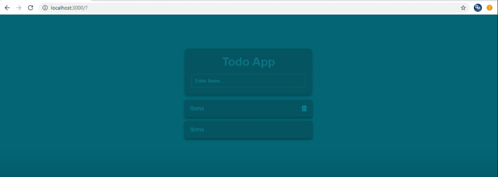

# A React Todo Application

A web app to Create, Display ,Update and Delete Todo.
  
## How to run?
### Step 1: Use 'npm install' to install the project packages.
### Step 2: Then use 'npm start' to start the application
  
## Issues
https://github.com/dscmbcet/hacktoberfest-2021/issues/37

## Libraries used:
React-router-dom for routing

# Images

